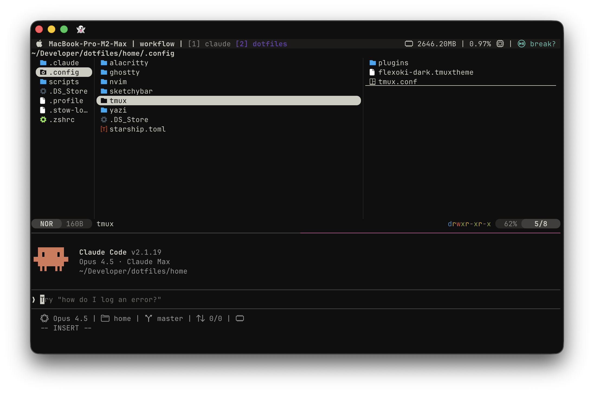

# dotfiles

Personal macOS terminal environment. Managed with GNU Stow.



## Features

- **Tmux** — Session management, floating panes, lazygit popup
- **Neovim** — LazyVim configuration
- **Yazi** — Terminal file manager
- **Ghostty** — Primary terminal (Alacritty as backup)
- **Starship** — Minimal prompt
- **SketchyBar** — Custom macOS menu bar
- **Claude Code** — AI-assisted git workflow via shell aliases

All tools use [Flexoki Dark](https://stephango.com/flexoki) for consistent theming.

## Install

```bash
git clone https://github.com/patrykmoga/dotfiles.git ~/Developer/dotfiles
cd ~/Developer/dotfiles
stow -d . -t ~ home
```

Preview changes first: `stow -n -d . -t ~ --verbose home`

## What's Included

| Tool | Config | Notes |
|------|--------|-------|
| Zsh | `.zshrc`, `.profile` | Auto-starts tmux, zoxide, fzf |
| Tmux | `.config/tmux/` | Backtick prefix, tpm plugins |
| Neovim | `.config/nvim/` | LazyVim-based |
| Starship | `.config/starship.toml` | Minimal left, info right |
| Yazi | `.config/yazi/` | Flexoki theme |
| Ghostty | `.config/ghostty/` | Primary terminal |
| SketchyBar | `.config/sketchybar/` | macOS menu bar |
| Claude | `.claude/` | Settings, skills, agents (submodule) |

## Tmux Keybindings

Prefix: `` ` `` (backtick)

| Key | Action |
|-----|--------|
| `o` | Session picker |
| `f` | Floating pane |
| `g` | Lazygit |
| `p` | Pomodoro |
| `r` | Reload config |

## Shell Aliases

```bash
y      # Yazi with directory changing
z      # Zoxide jump
gc     # Git commit (via Claude)
gcp    # Git commit + push (via Claude)
gpr    # Create PR (via Claude)
```

## Requirements

[Homebrew](https://brew.sh), then: `brew install stow tmux neovim starship yazi zoxide fzf bat lazygit`
